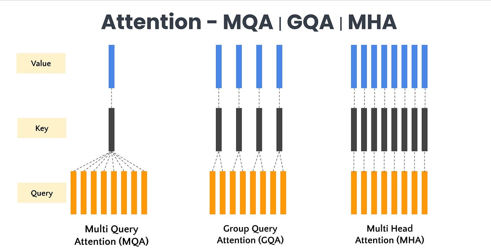

# LLMs Architecture 

This repository contains "from-scratch" implementations of **Large Language Models (LLMs)**. The goal is to understand the internal mechanics of these models by implementing them layer-by-layer in PyTorch.

---

## Implemented Architectures

1.  **GPT-2** (The foundational decoder-only transformer)
2.  **BERT** (Encoder-only, masked language modeling)
3.  **Llama** (Includes techniques like RoPE, GQA, KV cache)
4.  **Mistral** (Sliding Window Attention, RoPE)
5.  **Qwen** (RoPE, GQA, KV cache)
6.  **Qwen MoE** (Mixture of Experts implementation of Qwen, KV cache)
7.  **DeepSeek-V3** (Advanced MoE, Multi-Head Latent Attention - MLA)

---

## Repository Structure

This repository is organized by model architecture, with shared components in `common` and inference scripts in `test`.

### **Core Model Folders**
* **`GPT2/`**: Contains the standard GPT-2 implementation.
* **`BERT/`**: Contains the BERT architecture (Encoder) and relevant modules.
* **`Llama/`**: Implementation of Llama 2/3 with specific features like **RoPE** (Rotary Positional Embeddings) and **GQA** (Grouped Query Attention).
* **`Mistral/`**: Features **Sliding Window Attention**.
* **`Qwen/`** & **`Qwen_moe/`**: Implementation of the Qwen family, including the **MoE (Mixture of Experts)** variant.
* **`DeepSeekV3/`**: Implementation of DeepSeek's **MLA (Multi-Head Latent Attention)** and MoE routing logic.

### **Utility & Testing**
* **`common/`**: Shared building blocks used across different models (e.g., FeedForward blocks, RoPE, Normalization layers).
* **`test/`**: Inference scripts to verify model generation.
    * `gpt_inference.py`: Generation loop for GPT models.
    * `llama_inference.py`: Testing Llama with RoPE/GQA.
    * `qwen_inference.py`: Testing Qwen and Qwen-MoE.
    * `bert_inference.py`: Masked token prediction tests.
---

## Goals 
- **Demystify Black Boxes**: Implement complex architectures (MoE, MLA, RoPE) from scratch to understand *why* they work.
- **Modular Design**: Use the `common` folder to reuse components (like FFN layers) across different families.
- **Inference Ready**: Provide `_inference.py` scripts to immediately test the architectures with loaded weights or random initialization.

---

## References & Research Papers
The implementations follow the official technical reports:

1.  **GPT-2**: [Language Models are Unsupervised Multitask Learners](https://d4mucfpksywv.cloudfront.net/better-language-models/language_models_are_unsupervised_multitask_learners.pdf)
2.  **BERT**: [BERT: Pre-training of Deep Bidirectional Transformers](https://arxiv.org/abs/1810.04805)
3.  **Llama**: [Llama 2: Open Foundation and Fine-Tuned Chat Models](https://arxiv.org/abs/2307.09288)
4.  **Mistral 7B**: [Mistral 7B](https://arxiv.org/abs/2310.06825)
5.  **Qwen**: [Qwen Technical Report](https://arxiv.org/abs/2309.16609)
6.  **DeepSeek-V3**: [DeepSeek-V3 Technical Report](https://arxiv.org/abs/2412.19437)

---

## Future Work 
- [ ] Implement **Beyond Attention Models** (TRM, Text Diffusion Models) architectures.
- [ ] Implement **Add More LLMs** architectures.

## Contributions
Feel free to contribute to this repository or suggest improvements.